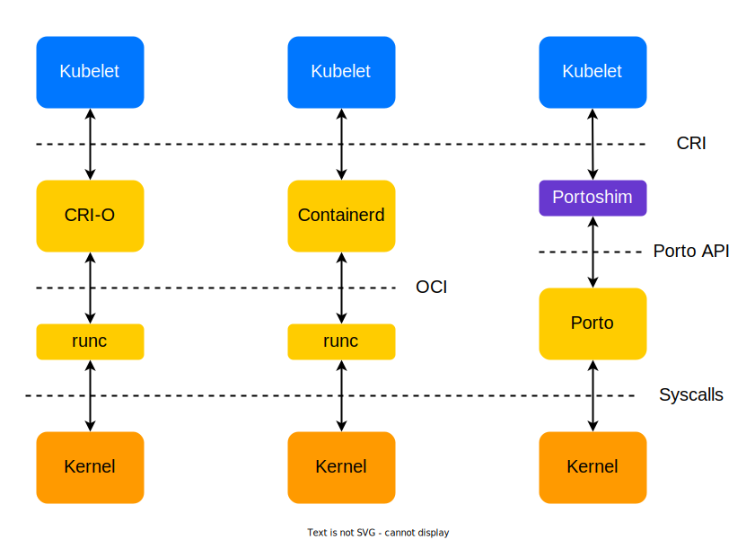

# Portoshim

Portoshim is a CRI ([Container Runtime Interface](https://kubernetes.io/docs/concepts/architecture/cri)) plugin 
for [Porto](https://github.com/ten-nancy/porto) container management system.

Portoshim allows Porto daemon to communicate with kubelet, so Porto can be used as Kubernetes container runtime. 
Portoshim is written on Go programming language.




## Quick start

### Dependencies

Install [Porto container runtime](https://github.com/ten-nancy/porto/blob/master/README.md) and [Go programming language](https://go.dev/doc/install) (at least v1.17).
Run Porto after installation.

### Build

Download Portoshim project from github.com:
```bash
git clone https://github.com/ten-nancy/portoshim.git
cd portoshim
```

Build binary files using ```make``` and install them:
```bash
make
sudo make install
```


### Run

Execute Portoshim binary file (in background optionaly):
```bash
sudo portoshim &
```
or
```bash
sudo portoshim --debug & # add debug logs
```

The following socket has to appear after all actions ```/run/portoshim.sock```.

You can use [crictl](https://github.com/kubernetes-sigs/cri-tools) to check portoshim is running:
```bash
crictl --runtime-endpoint="unix:///run/portoshim.sock" ps
``` 

Also you can write the following config to ```/etc/crictl.yaml``` and do not specify endpoint flags:
```yaml
runtime-endpoint: unix:///run/portoshim.sock
```


## Kubernetes over Porto

You should specify two kubelet flags to use Kubernetes with Porto:
```bash
--container-runtime="remote"
--container-runtime-endpoint="unix:///run/portoshim.sock"
```

Kubelet uses Portoshim as a CRI service and sends CRI gRPC request to it. 
In turn Portoshim converts СRI request from kubelet to Porto request and forward it to Porto. 
Porto performs request. So Portoshim works as proxy between kubelet and Porto.

## Configuration file

### Usage

You can override default values of Portoshim invariants of run or add information about your custom registries using configuration file. Default path of configuration file is ```/etc/portoshim.yaml```. You also can set own path using ```--config``` flag:
```bash
sudo portoshim --config <config path>
```

### Fields description

Portoshim configuration file is a YAML file. It has following fields:  
- **Portoshim**:
    - **ConfigPath**  
        default: ```/etc/portoshim.yaml```  
        Configuration file path. Can be override only by ```--config``` flag.  

    - **Socket**  
        default: ```/run/portoshim.sock```  
        Portoshim socket path.  

    - **LogsDir**  
        default: ```/var/log/portoshim"```  
        Directory for logs. Portoshim logs are written to ```LogsDir/portoshim.log```.  

    - **VolumesDir**  
        default: ```/place/portoshim_volumes```  
        Directory for container root volumes.  


- **Porto**:

    - **RuntimeName**  
        default: ```porto```  
        Container runtime name.  

    - **Socket**  
        default: ```/run/portod.socket```  
        Porto socket path. Should not be changed. 


    - **ImagesDir**  
        default: ```/place/porto_docker```  
        Directory with Porto images. Should not be changed.  


- **CNI**:

    - **ConfDir**  
        default: ```/etc/cni/net.d```  
        Directory with CNI configuration files.  

    - **BinDir**  
        default: ```/opt/cni/bin```  
        Directory with CNI binary file.  

    - **NetnsDir**  
        default: ```/var/run/netns```  
        Directory with network namespaces.  


- **StreamingServer**:

    - **Address**  
        default: ```[::]```  
        IP address for streaming server. Streaming server is used for std io flows while exec using.  

    - **Port**  
        default: ```7255```  
        Port for streaming server. Streaming server is used for std io flows while exec using.


- **Images**:

    - **PauseImage**  
        default: ```registry.k8s.io/pause:3.7```  
        Pause image for pods.  

    - **Registries**  
        default: empty  
        List of registry info. Registry info has following fields:  
        - **Host**  
            Example: ```registry-1.docker.io```  
            Host of registry.  

        - **AuthToken**  
            Example: ```file:/path/to/file/with/token```  
            Authentication token. It can be setted via file or requested using auth path and auth service.  

        - **AuthPath**  
            Example: ```https://auth.docker.io/token```  
            Path (URL exactly) which is used for token request.   

        - **AuthService**  
            Example: ```registry.docker.io```  
            Service which is specified as parameter ```service``` while token is requesting.  

### Example

The example of simple Portoshim configuration file:
```yaml
Portoshim:
    LogsDir: /var/log/portoshim
Images:
    Registries:
    - Host: registry-1.docker.io
      AuthPath: https://auth.docker.io/token
      AuthService: registry.docker.io
```
